# 🧊 Antarctic Vessel Routing & Ice-Risk Forecasting System

**Uncertainty-aware route and departure planning for Antarctic voyages.** The system turns ensembles of sea-ice forecasts into a *route-level* risk estimate, then finds the cheapest route and the earliest departure date whose risk stays within a stated budget **under the modelled scenarios**.

> ⚠️ **This system is a research/decision-support prototype and is not certified for navigation or safety-critical operational use.** Antarctic operations require authoritative ice information, vessel-specific operating limits, applicable ice-class guidance and qualified human oversight.
>
> The figures and tables in the Phase 1-4 sections below use **controlled-synthetic** data and are labelled as such. Real-data results (OSI SAF sea ice, ERA5 winds, CMEMS currents, USNIC icebergs) are summarised in [Real-data status](#-real-data-status) with their limitations.

### 🏁 Headline result (controlled-synthetic backtest, 20 voyages, 5 held-out seasons)

| | Voyages meeting observed hazardous ice | Hours in hazardous ice | Start → arrival |
|---|---|---|---|
| Naive (leave now, shortest route) | **45%** | 4.0 h | 1.6 d |
| Fixed 50 km ice-edge buffer | 0% | 0 h | 12.8 d |
| **This system** | **0%** | **0 h** | **8.3 d** |

On this synthetic backtest it had no breaches, like the conservative buffer rule, and finished voyages **4.5 days sooner**. Its predicted risk at departure (mean P(breach) 0.3%, 95% upper bound 3.7%) is consistent with the realised 0 of 20 breaches. Synthetic results are not evidence of real-world skill.

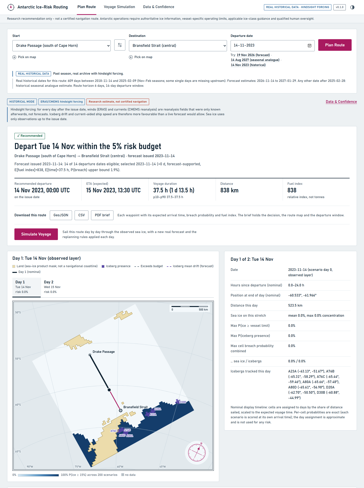

---

## ✨ What makes it different

| | Typical ice routing | This system |
|---|---|---|
| **Risk** | Per-cell probabilities multiplied as if independent | Each route is *sailed through every joint scenario*, so P(breach) respects spatial/temporal correlation |
| **Risk claim** | "P = 3%, looks fine" | A route is accepted only if the **Wilson upper bound** on P(breach) is within budget, so the scenario sample must support compliance (within the modelled scenarios, not a guarantee) |
| **Question answered** | "Which route?" | "**When** should we leave, **and** which route?" - a departure-window sweep with a pre-declared selection rule |
| **Honesty** | Always returns a route | Returns **`infeasible`** with a diagnosis (e.g. *"the destination itself is iced in 40% of scenarios"*) |
| **Forecast** | One deterministic map | Residual U-Net ensembles. On synthetic data it beats every baseline; on **real** OSI SAF data it beats damped persistence and climatology but **not persistence** in a statistically trusted way. Per-cell probability calibration exists but is **not** used in route risk |
| **Icebergs** | Static danger zones | Physics drift ensemble (dx/dt = βu<sub>o</sub> + αu<sub>a</sub>; real-data calibrated β = 0.1, spread factor 0.6053) joined to the *same* joint scenarios as sea ice |
| **Provenance** | - | Every stage emits a `StageResult` with checksums and `real` / `controlled_synthetic` / `modelled` labels; missing data = `blocked`, never faked |

---

## 📸 Demo (controlled-synthetic data)

**Departure-window planner.** The ice edge retreats through December. Departures up to 20 Dec exceed the 5% budget (hatched red), and the planner selects **23 Dec, the first date whose Wilson upper bound passes** (magenta). Shown in the dashboard's synthetic planner: every third day, 200 scenarios, 25 km grid.

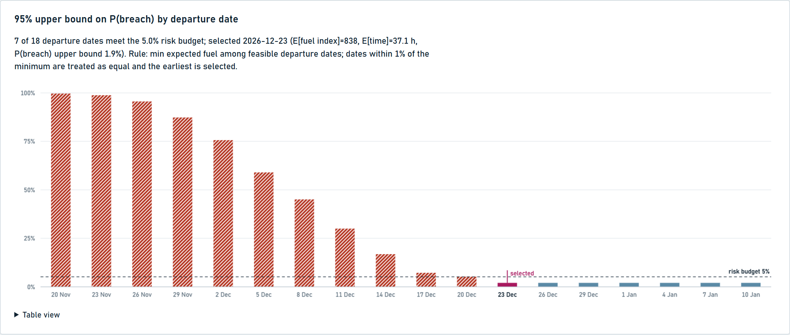

| Feasible departure (23 Dec) | Infeasible departure (8 Dec) |
|---|---|
| 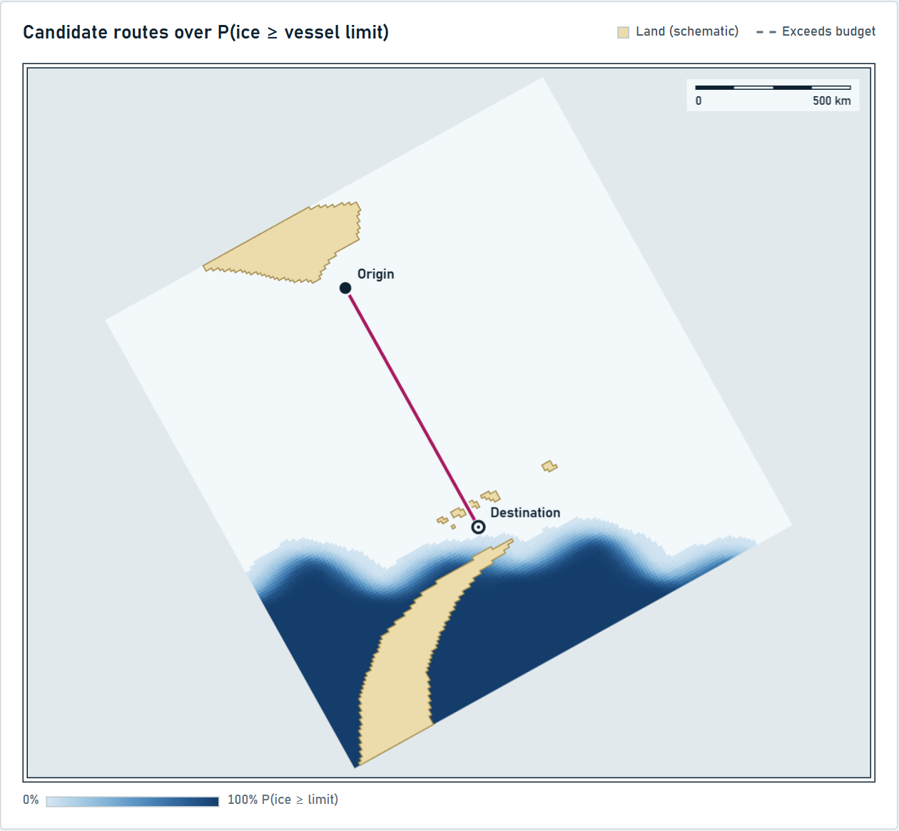 | 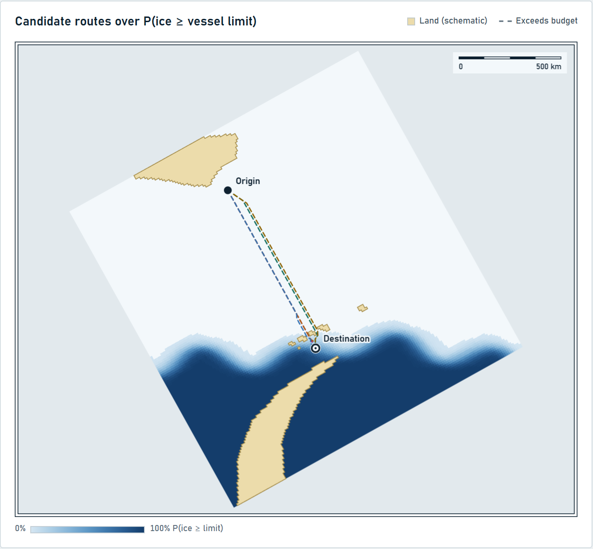 |
| Recommended route (green): 0 of 200 scenarios breach, 95% upper bound 1.9% ≤ 5% | Every candidate breaches in 40.5% of scenarios (dashed) - the **destination itself** is iced; no route can help, so the planner says so |

**Iceberg avoidance.** A tracked berg (purple, drift-ensemble presence) sits on the direct line. The shortest route breaches in 100% of scenarios; the recommended route detours 19 km (+0.8 h) and breaches in none (upper bound 1.9%).

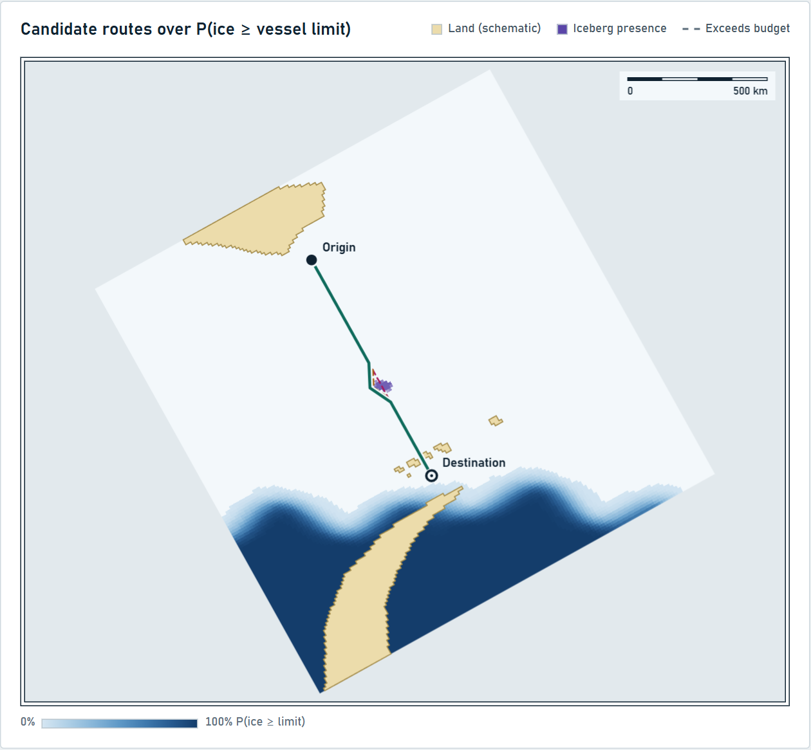

The three maps are the dashboard's synthetic planner on the 10 km grid (200 scenarios). Background: probability that ice concentration exceeds the vessel limit. Geography is a **schematic** Drake Passage → Bransfield Strait world (Tierra del Fuego, South Shetland Islands, Antarctic Peninsula), not a navigational coastline.

---

## 🧠 Phase 2 results: forecasting and calibration (controlled-synthetic)

Trained on 14 seasons, validated on 3, tested on 3 **held-out** seasons (2021-2023), 14-day input, 1-7 day leads, 25 km grid. The synthetic history has real dynamics: a retreating edge, mean-reverting seasonal anomalies (ρ = 0.961 fitted on training seasons) and ice tongues drifting east with the current.

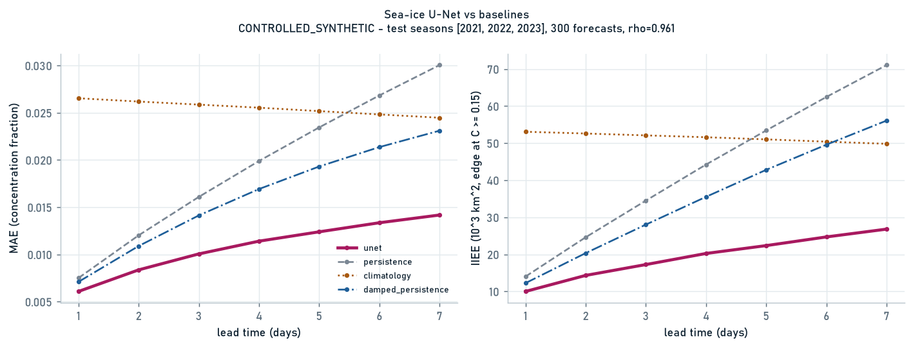

| Lead | **Residual U-Net** | Direct U-Net | Persistence | Damped persistence | Climatology |
|---|---|---|---|---|---|
| 1 d | **0.0061** | 0.0083 | 0.0075 | 0.0071 | 0.0265 |
| 4 d | **0.0115** | 0.0126 | 0.0199 | 0.0169 | 0.0255 |
| 7 d | **0.0141** | 0.0148 | 0.0300 | 0.0231 | 0.0245 |

MAE of concentration fraction on identical samples and ocean cells. The **direct** U-Net loses to persistence at day 1 ("a neural network is not automatically better than persistence"). Predicting the *change* from today's map (Ĉ = C<sub>t</sub> + Δ, zero-initialised head so an untrained model *is* persistence) fixes this: the residual model is 14% better than the best baseline at day 1 and 39% better at day 7, with ice-edge error (IIEE) roughly halved.

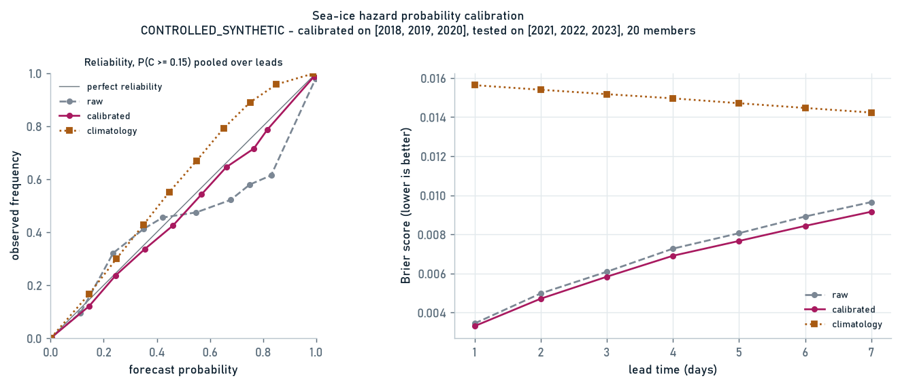

**Probabilities.** Members = forecast + whole historical error fields from training seasons, so they are coherent joint scenarios. The raw ensemble is **over-confident** (grey, dashed). Per-lead isotonic calibration fitted on validation seasons puts it on the diagonal (magenta) and lowers the Brier score at every lead on the test seasons. Brier skill vs climatology: 0.79 (1 d) to 0.38 (7 d).

---

## 🧭 Phase 3 results: deciding *when* to leave, and adapting at sea (controlled-synthetic)

**Forecast-driven scenarios.** A forecast issued on day *t* becomes joint scenarios: layer 0 is the observation; leads 1-14 are the U-Net plus whole training-season error sequences; beyond the forecast horizon, each member replays one training season's daily **anomaly sequence** on top of climatology (it never repeats the last forecast). A test confirms that overwriting every observation after the issue date leaves the scenarios **byte-identical**, so there is no look-ahead.

**Trust horizon.** The last lead for which the model's improvement over *both* damped persistence and climatology has a positive 95% lower bound under a **season-blocked bootstrap** (5 held-out seasons).

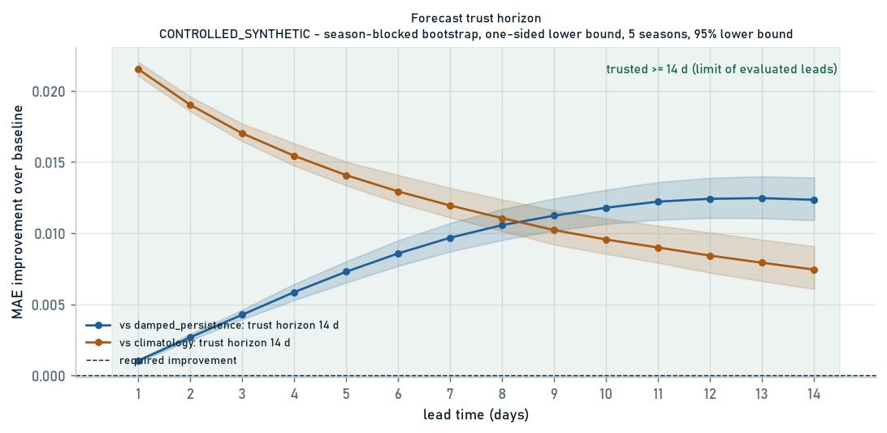

On this synthetic history the U-Net keeps significant skill through day 14, so the horizon is reported as **≥ 14 d (limited by the evaluated leads)**, not as a measured end point. The margin over climatology shrinks with lead (0.022 → 0.007), and real sea ice should give a much shorter horizon.

**Departure window from one forecast.** Forecast issued 28 Nov 2023 (held-out season), 200 joint scenarios, departures +0 … +13 d. Only the next three days meet the 5% budget under the Wilson upper bound. Later dates get *riskier* even though the ice is retreating, because forecast uncertainty grows with lead time. The planner selects **today**.

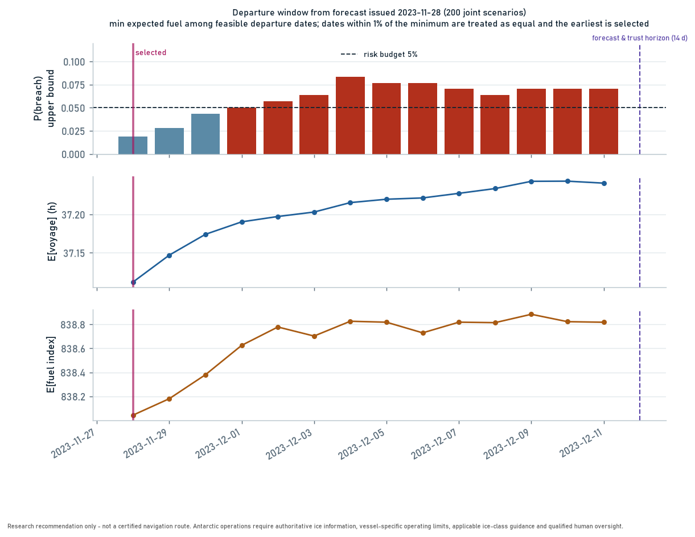

**Replanning and replay.** Each day in port, the planner issues a forecast and plans the window; it leaves only when the selected departure is *today*. At sea, the ship advances 24 h through the **observed** ice and then replans from its position. It switches route only when the current route exceeds the budget or an alternative is materially better, and raises an alert only when the path moves more than 25 km. Every decision is appended to `audit.jsonl`.

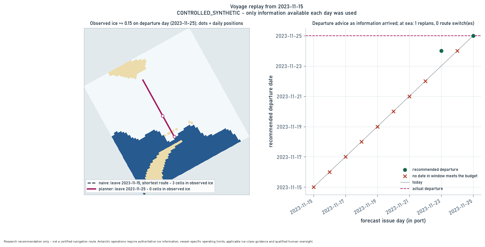

| Replay from 15 Nov 2023 | Departs | Voyage | Fuel index | Route cells in observed ice ≥ 15% |
|---|---|---|---|---|
| Naive (leave day 1, shortest route) | 15 Nov | 38.6 h | 921 | **3** |
| **This system** | 25 Nov (advice evolved daily) | 37.1 h | **838** | **0** |

One replay on synthetic data is a demonstration, not evidence. Phase 4 repeats it across seasons and start dates and measures the cost of caution as well as the safety gained.

---

## 🧪 Phase 4 results: validation and product (controlled-synthetic)

**Replay backtest.** 5 held-out seasons × 4 start dates (15 Nov, 25 Nov, 5 Dec, 15 Dec). Each voyage is replayed three ways and sailed through the **observed** ice:

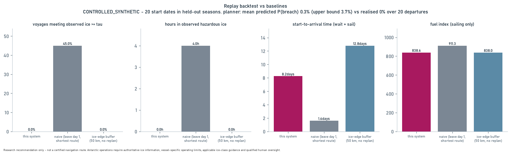

| Method | n | Breach rate | Hazard hours | Days waited | Start → arrival | Fuel index |
|---|---|---|---|---|---|---|
| Naive: leave on the start date, shortest route | 20 | 45% | 4.0 | 0.0 | 38.7 h | 911 |
| Ice-edge buffer: first day a route keeps 50 km from observed ice, no replanning | 20 | 0% | 0.0 | 11.2 | 307 h | 838 |
| **This system** | 20 | **0%** | **0.0** | **6.7** | **198 h** | **839** |

The planner's mean predicted P(breach) at departure was 0.3% (95% upper bound 3.7%), against a realised 0/20. Twenty voyages cannot confirm calibration at the 5% level; they show the estimates are not optimistic.

**Fuel/speed sensitivity.** The 20 Dec recommendation is unchanged across all 28 (λ, k) settings, because the route is in open water. Unit tests confirm the analysis *does* flag a change when a route crosses costly sub-limit ice.

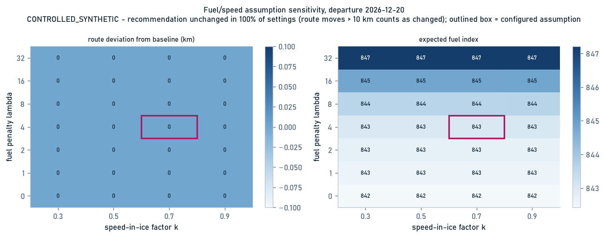

**Product.**
- **FastAPI backend:** jobs for long runs, voyage replan/history/export, 422/409/400 errors with reasons; `/status`, `/versions`, `/provenance` and read-only `/real/*` endpoints for a verified real-data bundle.
- **Chosen origin/destination (Real Historical Data):** preset or lat/lon locations snapped to the nearest navigable 25 km cell, with a route-specific forecast horizon; see [docs/LOCATIONS.md](docs/LOCATIONS.md).
- **One-call plan (`POST /real/plan`, Real Historical Data):** route, recommended departure, ETA, distance, fuel index, sea-ice / iceberg / combined risk and a daily timeline in one response, with hindsight-forcing disclosure; see [docs/PLAN_API.md](docs/PLAN_API.md).
- **Voyage simulation (`POST /real/simulate`, Real Historical Data):** the planned voyage sailed day by day through the observed sea ice, with a new real forecast and the existing replanning rules each day, as playback frames; see [docs/SIMULATE_API.md](docs/SIMULATE_API.md).
- **Additional historical season (Real Historical Data):** the separate OSI-430-a v3.0 2024-25 sea-ice file is listed under `sea_ice_additional` in `config/real_historical.json` (with its 2024-25 ERA5, CMEMS and USNIC files) and appended in memory after the frozen file. The frozen file, checkpoint and calibration are unchanged. 2024-25 is labelled an independent evaluation season.
- **Web dashboard:** a chart-style interface with latitude/longitude graticule, scale bar and compass rose. The result page compares the candidate routes on the same scenarios, shows how much of each departure is forecast-supported together with the forecast's trust horizon, and downloads the route as GeoJSON or CSV (each waypoint with expected arrival time, breach probability and fuel index) and the plan as a PDF brief. Every plan is saved, so a recent one reopens without being computed again; with a Supabase project configured the saved plans survive restarts ([setup](docs/DEPLOYMENT.md#14-saved-plans-supabase)). Light and dark themes, phone-width, no external dependencies. Browser-tested with Playwright against a stand-in API: every page exercised, no console errors.
- **Forecast mode (future dates, e.g. 2026-11-19):** dates after the real archive are planned and simulated as a labelled *Forecast / hackathon estimate* from an analogue season (proxy sea ice and ERA5/CMEMS forcing, latest official USNIC list with calibrated drift). Any other future date (off season or years ahead, e.g. 2027-08-14 or 2030-08-14) gets a *historical seasonal analogue*: real sea ice, winds, currents and icebergs of the same calendar days in earlier years, with the analogue dates and a confidence level recorded. Neither is an operational forecast. See [docs/FORECAST_MODE.md](docs/FORECAST_MODE.md).
- **PDF voyage brief:** [example](docs/voyage_brief_example.pdf).
- **Docker image:** built and smoke-tested in CI.

| Route comparison, risk and departure window | Voyage simulation |
|---|---|
| 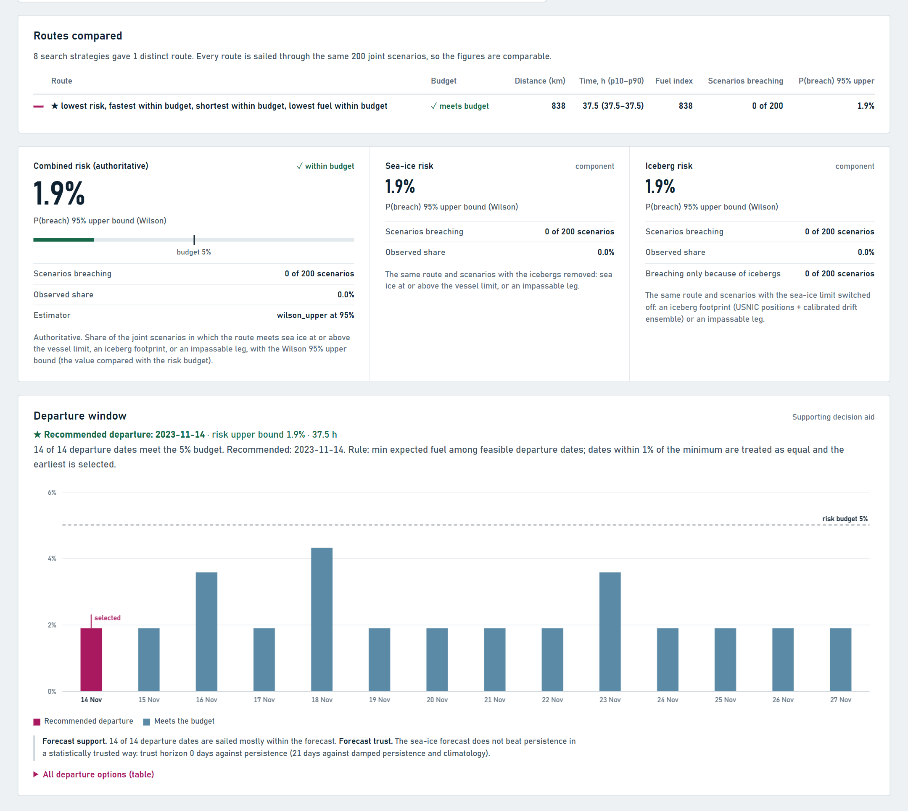 | 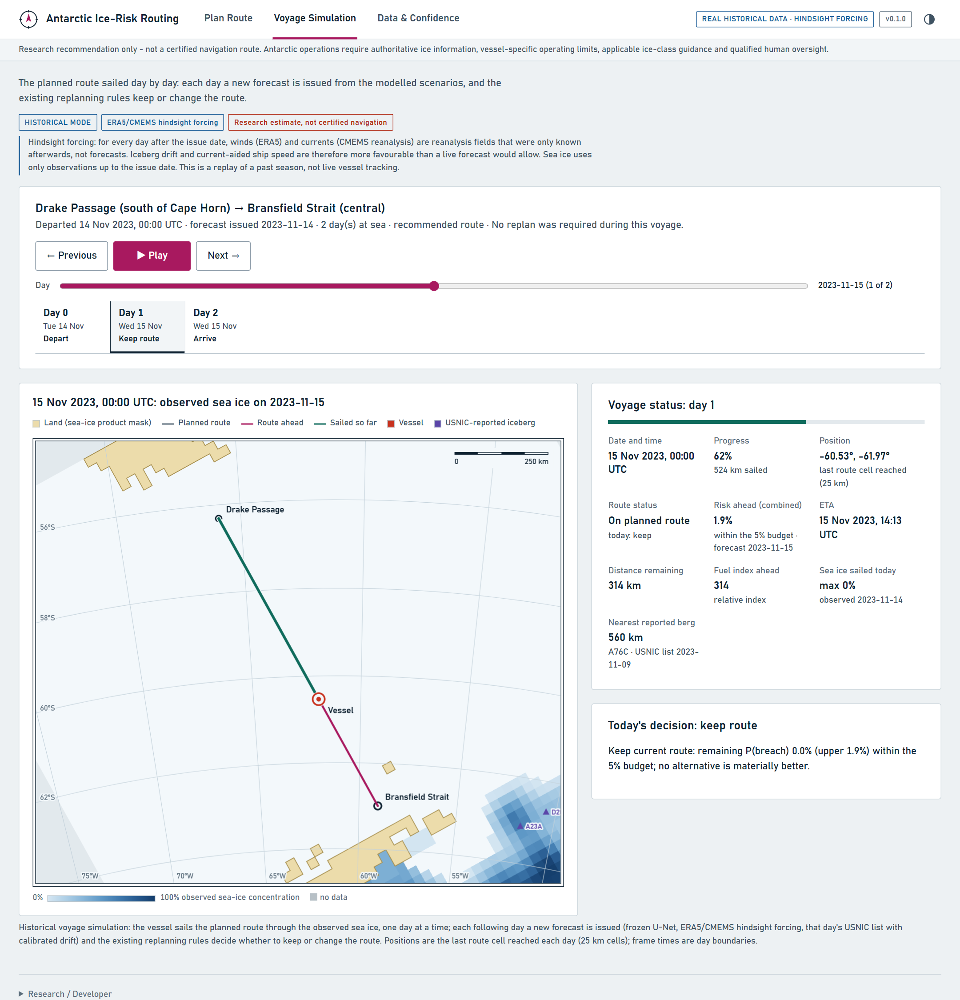 |

---

## 🌍 Real-data status

| Component | Real data used | Result | Honest limitation |
|---|---|---|---|
| Sea ice | OSI SAF OSI-450-a / OSI-430-a, 2004-2024, 25 km EPSG:3031 | Residual U-Net, test MAE 0.0093 vs persistence 0.0110 | Trust horizon **0 d vs persistence** |
| Winds / currents | ERA5 u10/v10; CMEMS GLORYS12V1 uo/vo at 0.494 m, daily | Used by the drift model and route speeds | Daily, 25 km, surface layer only |
| Icebergs | USNIC weekly lists 2018-2025 | Calibrated drift beats the original physics; coverage near nominal | Only slightly better than "no movement" on position |
| Frozen demo | Forecast issued 2023-11-14, 200 joint scenarios | Depart 2023-11-14, 37.5 h, fuel index 837.8, 0/200 breaches, Wilson UB 1.88% | One window; 1.88% is the 0-of-200 floor, not skill |

The frozen demo is reproducible: `scripts/reproduce_frozen_demo.py` checks every input checksum, re-runs the planner with real forcing required, and compares the result with [`docs/frozen_demo/frozen_demo_2023-11-14.json`](docs/frozen_demo/frozen_demo_2023-11-14.json). The comparison is exact on the platform that produced the pinned result. On another platform or PyTorch build the selected departure, route, breach count and risk bound are the same, but time and fuel can differ in the last floating-point digits, which the script reports as a difference. See [`docs/REPRODUCIBILITY.md`](docs/REPRODUCIBILITY.md).

**Run the real-data product on your own machine:** [`docs/RUNTIME_SETUP.md`](docs/RUNTIME_SETUP.md) shows how to use the runtime archive (a GitHub Release asset, not in Git). No API keys are needed to run it.

**No silent fallbacks.** Missing dates, files or credentials are errors or `blocked` results. Real sea ice with schematic forcing is labelled `mixed`/`schematic`, printed as a warning, and refused under `--require-real-forcing`. The API's interactive planner runs on the synthetic world and labels every response `controlled_synthetic`; real results are served only from a checksum-verified bundle, and the dashboard shows **Real / Historical / Forecast / Schematic / Unavailable** badges for every source.

## 🚀 Quickstart

```bash
git clone https://github.com/ryanshaon/antarctic-routing && cd antarctic-routing
python -m pip install -e ".[dev]"

antroute validate-config                         # check config/config.yaml
antroute demo --departure 2026-12-20             # -> artifacts/demo/
antroute departures --start 2026-11-20 --end 2027-01-10 --step-days 3
antroute demo --departure 2026-12-20 --iceberg A23A:-60.2:-62.6 --berg-radius-km 15

# Phase 2: forecasting (synthetic history by default; pass --data for real data)
antroute train-forecast --resolution-km 25 --lead-days 7 --out models/unet
antroute evaluate-forecast --resolution-km 25 --weights models/unet/best.pt
antroute calibrate-forecast --resolution-km 25 --weights models/unet/best.pt

# Phase 3: trust horizon, departure window from one forecast, day-by-day replay
S="--synthetic-seasons 2002:2026 --resolution-km 25 --n-val 3 --n-test 5"
antroute train-forecast $S --lead-days 14 --out models/unet14
antroute evaluate-forecast $S --weights models/unet14/best.pt --out reports/forecast14
antroute trust-horizon --report reports/forecast14/forecast_eval.json
antroute plan-window $S --weights models/unet14/best.pt --issue 2023-11-28 --window-days 14 \
    --trust-report reports/trust/trust_horizon.json
antroute replay $S --weights models/unet14/best.pt --start 2023-11-15 --window-days 7

# Real OSI SAF data (needs network access to thredds.met.no)
antroute fetch-sea-ice --start 2024-11-01 --end 2025-02-28
antroute build-dataset --inputs "data/raw/sea_ice/**/*.nc" --out data/processed/sea_ice.nc
antroute train-forecast --data data/processed/sea_ice.nc --n-val 1 --n-test 1

# Phase 4: validation and product
antroute backtest $S --weights models/unet14/best.pt --window-days 7 --members 120
antroute sensitivity --departure 2026-12-20
antroute brief --departure 2026-12-24 --out reports/voyage_brief.pdf
pip install -e ".[api]" && antroute serve        # dashboard: http://127.0.0.1:8000  API docs: /docs

# Real-data frozen demo (needs the real inputs; never committed to Git)
ANTROUTE_DATA_ROOT=/path/to/real-data python scripts/reproduce_frozen_demo.py \
    --out reports/frozen-demo --bundle artifacts/bundle
ANTROUTE_ARTIFACTS_DIR=artifacts/bundle antroute serve   # dashboard "Real-data demo" tab

python -m pytest                                 # full test suite
```

`antroute demo` writes `plan.json` (all candidates + explanation), `route_map.png`, `recommended_route.geojson` / `.csv` (with disclaimer, issue time, config SHA-256) and a provenance `stage-result.json`.

### 🐳 Docker

```bash
docker compose up --build        # dashboard + API on http://localhost:8000
```

The default image is the API and dashboard only (no PyTorch, no data clients). It can serve the verified real-data bundle built in from `deploy/bundle` (`ANTROUTE_ARTIFACTS_DIR=/app/deploy/bundle`) or one mounted read-only at `/app/bundle` (see `.env.example`). `docker build --target worker` builds the batch image with CPU PyTorch and the CDS/CMEMS clients for the CLI. Neither image contains datasets, weights or credentials. Pass Copernicus credentials as environment variables to ingestion workers only; never commit them.

Hosted deployment (dashboard on Vercel from `frontend/`, API on Render from `render.yaml`): [`docs/DEPLOYMENT.md`](docs/DEPLOYMENT.md).

### 🧰 Command reference

| Command | Stage | Purpose |
|---|---|---|
| `validate-config` | 1 | Validate the scenario and Wilson scenario-count guard |
| `fetch-sea-ice`, `build-dataset` | 2-3 | Download OSI SAF and harmonise it onto EPSG:3031 |
| `demo`, `departures` | 6-8 | Route plan / departure sweep (synthetic world, `--iceberg`) |
| `train-forecast`, `evaluate-forecast`, `calibrate-forecast` | 4 | U-Net, per-lead skill vs baselines, calibrated probabilities |
| `trust-horizon` | 8 | Season-blocked bootstrap trust horizon |
| `plan-window` | 8 | Departure window from one forecast issue |
| `replay` | 9 | Day-by-day voyage replay with replanning and audit log |
| `backtest`, `sensitivity` | 10 | Multi-season backtest vs baselines; fuel/speed sensitivity |
| `brief`, `serve` | 11 | PDF voyage brief; API + dashboard (`--artifacts-dir` serves a real-data bundle) |

---

## 🧭 Pipeline and status

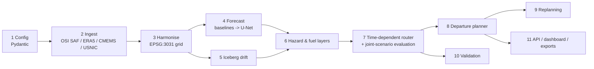

| Stage | Status | Module |
|---|---|---|
| 1 Scope & config | ✅ Validated config, Wilson scenario-count guard | `config.py` |
| 2 Ingestion | ✅ Resumable, checksummed, `blocked` on missing credentials; OSI SAF reader (own CRS from CF metadata) + dataset builder. The real inputs in use are listed under [Real-data status](#-real-data-status) | `ingestion/` |
| 3 Harmonisation | ✅ Regridding, vector rotation, area-mean, imputation mask, season-aware climatology | `preprocessing/` |
| 4 Sea-ice forecast | ✅ Baselines, residual U-Net, per-lead MAE/RMSE/IIEE evaluation, residual-bootstrap ensembles, isotonic calibration | `forecasting/` |
| 5 Iceberg drift | ✅ RK2 physics with projection scale factor, ensembles, presence layers joined to route risk, learned correction validated on held-out icebergs | `iceberg/drift.py` |
| 6 Hazard & fuel | ✅ | `routing/hazard.py`, `routing/fuel.py` |
| 7 Route optimisation | ✅ Time-dependent A*, candidates, risk-budgeted selection | `routing/` |
| 8 Departure planner | ✅ Forecast-driven joint scenarios, climatology-anomaly scenarios beyond the horizon, trust horizon, window from one issue with support/trust flags | `forecasting/scenarios.py`, `forecasting/trust.py`, `routing/departure.py` |
| 9 Replanning | ✅ Triggers, hysteresis, corridor alerts, stale-input flag, JSONL audit log, day-by-day replay | `routing/replan.py`, `replay.py` |
| 10 Validation | ✅ MAE/RMSE/IIEE/Brier/reliability, multi-season replay backtest vs naive and ice-edge buffer, fuel/speed sensitivity | `validation/`, `replay.py` |
| 11 Product | ✅ CLI, FastAPI with jobs, web dashboard, GeoJSON/CSV, PDF voyage brief, Docker | `cli.py`, `api/`, `dashboard/`, `brief.py`, `Dockerfile` |

---

## 📐 Core formulas

| Quantity | Formula |
|---|---|
| Speed | v<sub>km/h</sub> = 1.852 · v<sub>kn</sub>; in ice v<sub>s</sub> = max(v<sub>cruise</sub>(1 − kC), v<sub>min</sub>); ground v<sub>g</sub> = v<sub>s</sub> + u<sub>∥</sub> (impassable if ≤ 0) |
| Anomaly / damped persistence | A = C − μ(d); Ĉ<sub>t+h</sub> = clip(μ(d<sub>t+h</sub>) + ρ<sup>h</sup>A<sub>t</sub>, 0, 1), ρ fitted on training seasons |
| Threshold probability | p̂ = (1/K) Σ<sub>k</sub> 1[C<sup>(k)</sup> ≥ τ<sub>v</sub>] |
| Fuel index | c = d [1 + λ g(C)], g = C² (or piecewise, steep above τ<sub>v</sub>) |
| Search edge cost | w<sub>D</sub>d + w<sub>T</sub>Δt + w<sub>F</sub>c − w<sub>R</sub> ln(1 − p<sub>haz</sub>) (additive risk *guidance* only) |
| **Route risk** | P̂(B<sub>R</sub>) = (1/K) Σ<sub>k</sub> 1[route R breaches in scenario k] (joint, not a product of cells) |
| **Selection** | min<sub>R</sub> E[F<sub>R</sub>] s.t. Wilson-UB<sub>95%</sub>(P̂(B<sub>R</sub>)) ≤ r<sub>max</sub> |
| Scenario count | zero breaches certify r<sub>max</sub> only if n ≥ z²(1 − r)/r → **≥ 73 scenarios for 5%** (config rejects fewer) |
| Verification | MAE, RMSE, Brier = mean (p − o)², reliability bins |

---

## 🗂️ Repository layout

```
config/config.yaml          scenario: region, route, vessel, risk budget (illustrative values)
docs/ASSUMPTIONS.md         every assumption, its status and what replaces it
src/antarctic_routing/
  config.py                 Stage 1 - Pydantic validation, Wilson bound
  common/provenance.py      StageResult envelope, SHA-256, atomic JSON
  ingestion/                Stage 2 - OSI SAF, ERA5 (cdsapi), CMEMS (copernicusmarine), USNIC
  preprocessing/            Stage 3 - EPSG:3031 grid, regridding, climatology, splits
  forecasting/              Stage 4 - baselines, U-Net, training, per-lead evaluation, calibration
  iceberg/drift.py          Stage 5 - drift physics, ensembles, presence layers, learned correction
  forecasting/scenarios.py  Stage 8 - forecast-issued joint scenarios (observed / forecast / climatology layers)
  forecasting/trust.py      Stage 8 - trust horizon (season-blocked bootstrap)
  routing/replan.py         Stage 9 - replanning triggers, hysteresis, audit log
  replay.py                 Stage 9/10 - day-by-day historical replay scored against observed ice
  validation/backtest.py    Stage 10 - multi-season replay backtest vs naive and ice-edge-buffer baselines
  validation/sensitivity.py Stage 10 - fuel/speed assumption sensitivity
  api/main.py               Stage 11 - FastAPI backend (jobs, voyages, figures)
  dashboard/                Stage 11 - self-contained web dashboard
  brief.py                  Stage 11 - PDF voyage brief
  synthetic.py              controlled-synthetic joint scenarios (schematic world)
  routing/                  Stages 6-8 - hazard, fuel, graph, A*, evaluation, candidates, departures
  validation/metrics.py     Stage 10 - MAE, RMSE, Brier, reliability
  export.py, viz.py, cli.py GeoJSON/CSV, figures, `antroute` CLI
tests/                      hand-calculated values, behavioural routing worlds, leakage and split checks
```

---

## 🔬 Engineering notes that matter

- **Vector rotation.** In EPSG:3031, east/north wind and current components must be rotated by longitude before use as grid x/y. This is tested against pyproj finite differences.
- **Distances.** EPSG:3031 is true-scale only at 71°S, so a "10 km" cell spans ~9.5 km at 60°S. All edge lengths are geodesic (WGS84).
- **No corner-cutting.** 16-connected moves are valid only if every crossed cell is navigable.
- **Leakage.** Climatology, normalisation and ρ use training seasons only. Seasons span New Year (Nov-Feb) and are labelled by start year.
- **Missing data is hazardous.** NaN concentration on an ocean cell is treated as ice, never as open water.
- **OSI SAF is not EPSG:3031.** OSI-401-b uses its own stereographic grid (true scale 70°S, Hughes ellipsoid, km). The reader takes the CRS from the file's CF metadata.
- **Iceberg drift on a map.** Velocities are ground speeds; a conformal projection moves a point at k·v, where k is the point scale factor. This is tested against geodesic distance (0.25 m/s × 6 h = 5.4 km).
- **No leakage across icebergs.** The learned drift correction is validated with whole icebergs held out.

---

## 🛣️ Roadmap

1. **Phase 1 ✅** config, ingestion framework, harmonisation, baselines, hazard/fuel, router, departure sweep, exports.
2. **Phase 2 ✅** OSI SAF reader, residual U-Net vs baselines per lead, calibrated probabilities, iceberg drift ensembles in route risk. The runs on real OSI SAF/ERA5/CMEMS data are item 5.
3. **Phase 3 ✅** U-Net ensembles drive the router, climatology-anomaly scenarios beyond the horizon, trust horizon (season-blocked bootstrap), departure window from one forecast issue, replanning with an audit log, day-by-day replay.
4. **Phase 4 ✅** replay backtest vs naive and ice-edge-buffer baselines, fuel/speed sensitivity, FastAPI, web dashboard, PDF brief, Docker.
5. **Real data (in progress):** real OSI SAF sea ice (20 seasons), U-Net trained and evaluated on real seasons, ERA5/CMEMS forcing, USNIC iceberg drift calibrated and confirmed out of sample, frozen real-data demo reproduced exactly on the reference platform (to about 10 significant digits elsewhere; see [`docs/REPRODUCIBILITY.md`](docs/REPRODUCIBILITY.md)). *Still open:* real-season backtests, verified vessel limits, persistent voyage storage, deployment (see [`docs/DEPLOYMENT.md`](docs/DEPLOYMENT.md)).

## 📚 Related work

- **PolarRoute / MeshiPhi** (British Antarctic Survey): open-source polar route planning on adaptive meshes.
- **IceNet** (Andersson et al., 2021, *Nature Communications*): deep-learning seasonal sea-ice forecasting.

This project focuses on what sits between them: turning *forecast uncertainty* into a **statistically bounded route-level risk estimate** (Wilson upper bound over joint scenarios) and a **departure-date decision**. The bound is only as good as the scenarios; it is not a certification.

## ⚖️ Limitations

- **Not certified.** Research/decision-support prototype only; not for navigation or safety-critical operational use.
- **Forecast skill on real data is limited.** The real-data trust horizon is **0 days against persistence** (21 days against damped persistence and climatology).
- **Probability calibration is not used in route risk.** The isotonic per-cell calibrator is validated, but route risk counts breaches over joint scenarios with a Wilson bound. A route result is not evidence that calibrated probabilities are used.
- **Iceberg drift skill is modest.** On position it is only slightly better than assuming no movement; its demonstrated value is probabilistic (coverage near nominal), confirmed on only 5-6 independent tracks. USNIC positions are weekly and cover only large icebergs.
- **Vessel parameters are placeholders**: a generic vessel and a placeholder ice class (`REPLACE_WITH_VERIFIED_CLASS`); fuel is an index. See [`docs/ASSUMPTIONS.md`](docs/ASSUMPTIONS.md).
- **Forcing resolution**: winds and currents are daily on a 25 km grid; currents are at 0.5 m depth, not keel depth.
- **Synthetic figures.** The Phase 1-4 figures are controlled-synthetic; synthetic dynamics are simpler than real sea ice.
