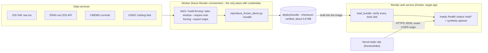

# Deployment: Vercel (dashboard) + Render (API)

Research / decision-support only. This system is not certified for navigation or safety-critical operational use.

**Status:** nothing is deployed yet. Every file and step below was checked locally, without a Vercel or Render
account:
- the API image was built and run the way Render runs it (`PORT=10000`, health check `/ready`);
- the Vercel build (`npm install`, `npm run build` in `frontend/`) was served from another origin and opened in
  Chromium against that API.

## 1. Architecture



| Tier | Runs | Holds | Never |
|---|---|---|---|
| **Vercel** (static) | `index.html`, `static/app.js`, `static/style.css` | The API's public URL, written in at build time | Credentials, NetCDF, training, any science |
| **Render web service** | `antroute serve` in the `api` image: verifies and serves one bundle read-only; synthetic interactive planner | Code, config, `deploy/bundle` | Credentials, PyTorch, ingestion, reading NetCDF |
| **Worker** (future) | Ingestion, U-Net inference, scenario ensembles, routing, bundle building (`worker` image) | Data-service credentials, raw data, model weights | Serving user traffic |

The API **never falls back to synthetic data**. If the bundle is missing or any checksum differs, every `/real/*`
endpoint and `/ready` return 503 with the reason, and the dashboard shows "Unavailable".

## 2. Files

| File | Purpose |
|---|---|
| `Dockerfile` | Default target `api` (no PyTorch, no data clients) binds `${PORT:-8000}`; `--target worker` adds CPU PyTorch and CDS/CMEMS clients for batch jobs |
| `render.yaml` | Render Blueprint for the API web service |
| `deploy/bundle/` | The verified real-data bundle built into the API image (see `deploy/README.md`) |
| `frontend/build.mjs`, `frontend/package.json`, `frontend/vercel.json` | Dependency-free static build of `src/antarctic_routing/dashboard` for Vercel |

## 3. Before the first deploy

1. **Commit the work, including `deploy/bundle/`.** Render and Vercel build from the GitHub repository.
   - The bundle is about 0.8 MB of derived results (JSON plus one PNG), not raw data or model weights.
   - If it should stay out of Git, push an image built locally (`docker build -t <registry>/antarctic-routing .`) to
     a registry, and create the Render service with "Deploy an existing image" instead of steps 4.1-4.3.
2. **Choose the two names; each one sets a URL.**
   - Render service name, e.g. `antarctic-routing-api` → `https://antarctic-routing-api.onrender.com`.
   - Vercel project name, e.g. `antarctic-routing` → `https://antarctic-routing.vercel.app`.
   - Each platform adds a suffix if the name is taken, so check the real URLs after creating them.

## 4. Render: the API

1. In Render: **New → Blueprint**, connect `HarshKunap/antarctic-routing` and pick the branch. Render reads
   `render.yaml`, which creates:
   - one web service, `antarctic-routing-api`;
   - Docker runtime from `./Dockerfile`, context `.`;
   - plan `standard`;
   - health check path `/ready`.
2. When Render asks for `ANTROUTE_CORS_ORIGINS`, enter the Vercel production origin exactly, for example
   `https://antarctic-routing.vercel.app`.
   - Use `https`, with no path and no trailing slash. Separate several origins with commas.
   - A wildcard or a malformed value stops the API at start-up, and the deploy fails with the reason in the logs.
3. Apply. The deploy log should end with `real-data bundle frozen_demo-2023-11-14-659bcedf3cef loaded and verified`.
   - Render only sends traffic to a new deploy once `/ready` returns 200.
   - A deploy whose bundle fails verification never goes live; the previous deploy keeps serving.
4. Check:
   ```bash
   curl https://antarctic-routing-api.onrender.com/ready     # {"ready":true,"real_data":"available",...}
   curl https://antarctic-routing-api.onrender.com/status    # per-source data status
   ```

**Without the Blueprint** (Render dashboard: New → Web Service → the repository):
- Language: Docker. Dockerfile path: `./Dockerfile`. Docker build context: `.`.
- Instance type: Standard. Health check path (Advanced): `/ready`. Leave the start command empty.
- Environment variables: as in the table below.

| Render variable | Value | |
|---|---|---|
| `ANTROUTE_ARTIFACTS_DIR` | `/app/deploy/bundle` | Required: the bundle built into the image |
| `ANTROUTE_CORS_ORIGINS` | `https://<project>.vercel.app` | Required for the Vercel dashboard |
| `ANTROUTE_MAX_COMPUTE` | `1` | Computations at once (requests and background jobs) |
| `ANTROUTE_MAX_SCENARIO_CELLS` | `6000000` (Standard) or `1000000` (512 MB) | Largest scenarios × grid cells per request |
| `ANTROUTE_LOG_LEVEL` | `INFO` | |
| `PORT` | set by Render (10000) | Do not set it |

**Never set on the web service:** `CDSAPI_URL`, `CDSAPI_KEY`, `COPERNICUSMARINE_SERVICE_USERNAME`,
`COPERNICUSMARINE_SERVICE_PASSWORD`, `ANTROUTE_DATA_ROOT`. The API reads none of them.

### Instance size

These figures were measured on the API image:

| Load | Memory |
|---|---|
| Idle, bundle loaded | about 200 MB |
| Dashboard default plan (200 scenarios, 25 km) | peak about 360 MB, 1.0-1.5 s |
| 200 scenarios on the 10 km grid | peak 1.0-1.3 GB, 5-6 s |

- **Standard (2 GB)** with `ANTROUTE_MAX_COMPUTE=1`: everything the dashboard offers works.
- **Starter or Free (512 MB):** set `ANTROUTE_MAX_SCENARIO_CELLS=1000000` and `ANTROUTE_MAX_COMPUTE=1`.
  - The real-data tab and the 25 km planner work.
  - 10 km requests are refused with 422 and the reason.
  - Free instances sleep when idle, so the first request after a pause is slow.
- Render introduced new plan IDs in 2026 (e.g. `1c-2g`); the legacy name `standard` in `render.yaml` is still
  accepted.

## 5. Vercel: the dashboard

1. In Vercel: **Add New → Project**, import `HarshKunap/antarctic-routing`.
2. **Root Directory: `frontend`.** `frontend/vercel.json` then sets:
   - framework: none;
   - install: `npm install` (there are no dependencies);
   - build: `npm run build`;
   - output: `dist`;
   - security headers: `frame-ancestors 'none'`, `X-Frame-Options`, `nosniff`, `Referrer-Policy`.

   Keep "Include files outside the Root Directory in the Build Step" switched on (the default). The build reads
   the dashboard from `src/antarctic_routing/dashboard`.
3. **Environment variable:** `ANTROUTE_API_BASE` = `https://antarctic-routing-api.onrender.com` for Production.
   This is the only variable the build reads, and it is public: it ends up in the page.
4. **Deploy.** The build log ends with
   `dashboard built in …/dist for the API at https://antarctic-routing-api.onrender.com`.
   - The build fails, with the reason, when `ANTROUTE_API_BASE` is missing, is not `https`, or has a path.
   - The page gets a Content-Security-Policy that allows connections and images only from itself and that origin.
5. Changing `ANTROUTE_API_BASE` needs a redeploy, because the value is written in at build time.
6. **Preview deployments** have their own URLs, which are not in the API's CORS list. Their API calls are refused
   and the dashboard shows "Unavailable". To test one, add its exact origin to `ANTROUTE_CORS_ORIGINS`; wildcards
   are refused on purpose.

## 6. Check the deployment

| Check | Expected |
|---|---|
| `GET /ready` | 200 `{"ready": true, "real_data": "available", "bundle_id": "frozen_demo-2023-11-14-659bcedf3cef"}` |
| `GET /health` | 200 `{"status": "ok", "real_data": "available", ...}` |
| Dashboard, Real-data demo tab | Badges per source; departure 2023-11-14, 37.5 h, fuel 837.8, 837.8 km |
| Dashboard, synthetic tabs | Labelled "Schematic"; a 25 km plan returns in about 1-2 s |
| The same page from an origin not in the list | Browser blocks the calls; the dashboard shows "Unavailable", no data |

How the API behaves when something is wrong:

| Situation | `/health` | `/ready` | `/real/*` | Render |
|---|---|---|---|---|
| Bundle verified | 200 `ok` | 200 | 200 | Live |
| Bundle missing or a checksum differs | 200 `degraded` | 503 + reason | 503 + reason | New deploy not promoted |
| `ANTROUTE_CORS_ORIGINS` malformed | Process exits at start | | | Deploy fails, reason in the log |
| All compute slots busy | | | | `POST ...?wait=true`, `/voyages`, replans: 503 with `Retry-After: 10`; background jobs queue |
| Body over `ANTROUTE_MAX_BODY_BYTES` | | | | 413, with or without `Content-Length` |
| Request over `ANTROUTE_MAX_SCENARIO_CELLS` | | | | 422 before any work |

## 7. API configuration

| Variable | Default | Meaning |
|---|---|---|
| `PORT` | `8000` | Port the image listens on (Render sets 10000) |
| `ANTROUTE_CONFIG` | `/app/config/config.yaml` | Scenario configuration |
| `ANTROUTE_ARTIFACTS_DIR` | unset | Bundle directory; unset = real data "Unavailable" and `/ready` 503 |
| `ANTROUTE_CORS_ORIGINS` | unset | Exact origins of a separately hosted dashboard (`https://host[:port]`; `http` only for localhost) |
| `ANTROUTE_MAX_COMPUTE` | 2 | Computations at once, in requests and background jobs; peak memory ≈ 0.2 GB + this × the largest request |
| `ANTROUTE_MAX_SCENARIO_CELLS` | 6,000,000 | Largest scenarios × grid cells per request |
| `ANTROUTE_MAX_BODY_BYTES` | 65,536 | Largest request body (the biggest valid request is a few KB) |
| `ANTROUTE_MAX_JOBS` | 200 | Jobs kept in memory (oldest finished first out) |
| `ANTROUTE_MAX_VOYAGES` | 100 | Voyages kept in memory (each keeps only its route, a few KB) |
| `ANTROUTE_FIGURES`, `ANTROUTE_FIGURES_MODE` | `/app/docs/images`, `controlled_synthetic` | Validation figures and their data label |
| `ANTROUTE_LOG_LEVEL` | `INFO` | Request log: method, path, status, duration, request id; never bodies or headers |
| `ANTROUTE_GIT_COMMIT` | unset | Commit shown by `/versions`; on Render `RENDER_GIT_COMMIT` is used when unset |

## 8. Secrets

- **Vercel:** only `ANTROUTE_API_BASE`, a public URL. The build reads no other variable; a test checks that
  credential values set in the build environment never reach the output.
- **Render web service:** no credentials.
  - The API code reads none, and a test checks that no endpoint returns them.
  - The image contains no `.env`, `.cdsapirc`, PyTorch or data clients.
- **Worker (when built):** credentials go into that service's own environment variables or secret files in Render,
  never into `render.yaml` values, the repository or the image. Use `.env.example` for the variable names.

## 9. Updating the real-data bundle

**Now:**
1. A machine with the data and the `worker` image or environment runs
   `scripts/reproduce_frozen_demo.py --bundle` (see `docs/REPRODUCIBILITY.md`).
2. The five files are copied unchanged into `deploy/bundle/`.
3. Commit. Render rebuilds and verifies the bundle before going live.

**Future Render worker or cron job:** it needs the data root and the `worker` image. The bundle would then reach the
API through object storage, because Render disks belong to a single service. That transfer, and selecting between
bundles, are not built.

## 10. Local check before deploying

```bash
docker build -t antarctic-routing .
docker run --rm -p 10000:10000 -e PORT=10000 -e ANTROUTE_ARTIFACTS_DIR=/app/deploy/bundle \
  -e ANTROUTE_CORS_ORIGINS=http://localhost:5173 -e ANTROUTE_MAX_COMPUTE=1 antarctic-routing
cd frontend && ANTROUTE_API_BASE=http://localhost:10000 npm run build && python3 -m http.server 5173 --directory dist
# open http://localhost:5173 ; curl http://localhost:10000/ready
```

## 11. Keep bundle files byte-exact

Copy bundle files only with tools that do not change them. The project's shared file folder adds a C2PA
content-credentials chunk (`caBX`) to PNG files after upload. The pixels stay the same but the bytes change, so a
bundle copied there fails verification, and the API correctly refuses it. Object storage, Git and `cp` on local
disk keep the bytes.

## 12. Not yet covered

| Gap | Effect | Needed |
|---|---|---|
| Jobs and voyages in memory | Lost on restart; one instance only (do not scale Render to more than 1 instance) | A database and job queue, only if voyages must survive restarts |
| No authentication or rate limiting | Anyone with the URL can run synthetic computations; each one is bounded by the limits above | Rate limiting at a gateway or CDN in front of Render, or auth |
| One built-in bundle | The real-data tab shows one historical window | The future worker, object storage and bundle selection |
| No monitoring beyond Render's | Failures only in logs and the health check | Alerts on `/ready`, log shipping |
| `worker` image not built here | This sandbox blocks `download.pytorch.org` | Build it where that host is reachable |

## 13. Performance (API image, this environment)

| Operation | Size | Time |
|---|---|---|
| Start-up including bundle verification | bundle 0.8 MB | under 0.1 s |
| `GET /real/forecast-map?layer=19` | 40 KB | 20 ms |
| `GET /real/plan-window` | 15 KB | 3 ms |
| `GET /real/figures/departure_window.png` | 109 KB | 4 ms |
| `POST /routes?wait=true`, 200 scenarios, 25 km | 22 KB | 1.0-1.5 s |
| `POST /routes?wait=true`, 200 scenarios, 10 km | 122 KB | 5-6 s |
| Frozen plan-window (worker, CPU) | 200 members, 20 layers | 25-80 s |
